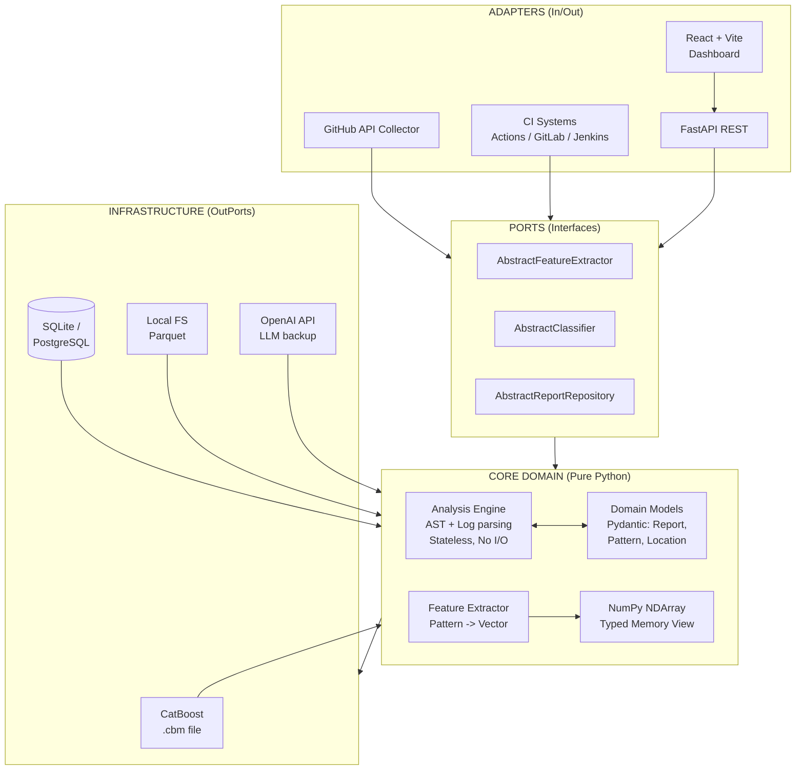
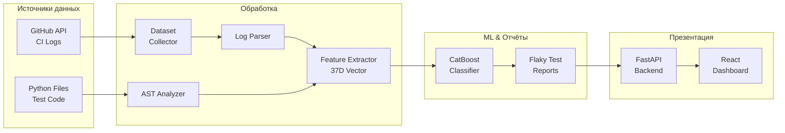

<div align="center">

# 🔬 FlakyDetector

[](https://www.python.org/)
[](https://fastapi.tiangolo.com/)
[](https://catboost.ai/)
[](LICENSE)

**Научный детектор нестабильных (flaky) тестов на базе AST-анализа и машинного обучения**

Scientific-grade · Explainable ML · AST Pattern Matching · 37D Feature Space

</div>

---

## 📖 Описание

**FlakyDetector** — исследовательский инструмент для выявления недетерминированных (flaky) тестов в Python-кодовых базах. Проект закрывает разрыв между статическим анализом кода и ML-классификацией, предоставляя объяснимые и применимые на практике результаты.

Вместо полагания исключительно на историю выполнения тестов, FlakyDetector парсит абстрактное синтаксическое дерево (AST) тестовых файлов, извлекает научные векторы признаков и классифицирует их с помощью обученной модели CatBoost.

---

## ✨ Ключевые возможности

| Возможность | Описание |
|-------------|----------|
| **🔍 AST Pattern Matching** | Нулевая зависимость от исполнения. Обнаруживает `time.sleep`, `datetime.now()`, мутации глобального состояния, немокированные сетевые вызовы и сравнения с плавающей точкой. |
| **🤖 ML Classification** | Объяснимая модель CatBoost, обученная на инженерных признаках (37-мерное векторное пространство). |
| **📊 Интерактивный дашборд** | React + Recharts фронтенд для визуализации распределения severity и важности признаков. |
| **🔬 Воспроизводимая наука** | Построен на Pydantic v2, строгой типизации и генераторах синтетических данных для 100% воспроизводимых ML-экспериментов. |

---

## 🏗️ Архитектура

### Clean Architecture



### Поток данных



---

## 🚀 Быстрый старт

**Требования:** Python 3.12+, Node.js 18+

### 1. Клонирование и настройка бэкенда

```bash
git clone https://github.com/yourorg/flakydetector.git
cd flakydetector
python -m venv .venv && source .venv/bin/activate
pip install -e ".[dev]"
```

### 2. Обучение ML-модели

Генерирует синтетический датасет и сохраняет `.cbm`:

```bash
python scripts/train_model.py
```

### 3. Запуск API-сервера

```bash
uvicorn flakydetector.dashboard.main:app --reload --port 8001
```

### 4. Запуск фронтенда (в новом терминале)

```bash
cd dashboard_frontend
npm install
npm run dev
```

🔗 Открой http://localhost:3000

---

## 🔬 Научная методология

Система преобразует исходный код в математическое представление:

| Категория признаков | Размерность | Описание |
|---------------------|-------------|----------|
| **AST Features** | 16 | Количество специфических антипаттернов (например, `ast_time_sleep: 1.0`) |
| **Category Features** | 9 | Агрегированные оценки корневых причин (Timing, State, Network) |
| **Derived Features** | 3 | Отношения: `ast_to_log_ratio`, `pattern_diversity` |
| **Confidence Scores** | 9 | Максимальная и средняя уверенность детекции |

**Итоговый вектор:** 37 измерений → CatBoost → вероятность flaky + Feature Importance для научной интерпретируемости.

---

## 📚 Цитирование

Если вы используете FlakyDetector в своих исследованиях, пожалуйста, цитируйте:

```bibtex
@software{flakydetector2026,
  author = {Research Team},
  title = {FlakyDetector: Scientific-grade AST & ML Flaky Test Detection},
  year = {2026},
  url = {https://github.com/yourorg/flakydetector}
}
```

---

## 👨‍💻 Автор

**Артем Алимпиев** —  Python Developer

- 🐙 GitHub: https://github.com/Artem7898
- 💼 LinkedIn: https://www.linkedin.com/in/artem-alimpiev/
- 📧 Email: alimpievne@gmail.com

---

## 📄 Лицензия

Распространяется под лицензией MIT. Подробности в файле [LICENSE](LICENSE).

---

<div align="center">

*Построено для воспроизводимой науки. AST + ML. Объяснимо. Детерминированно.*

</div>
