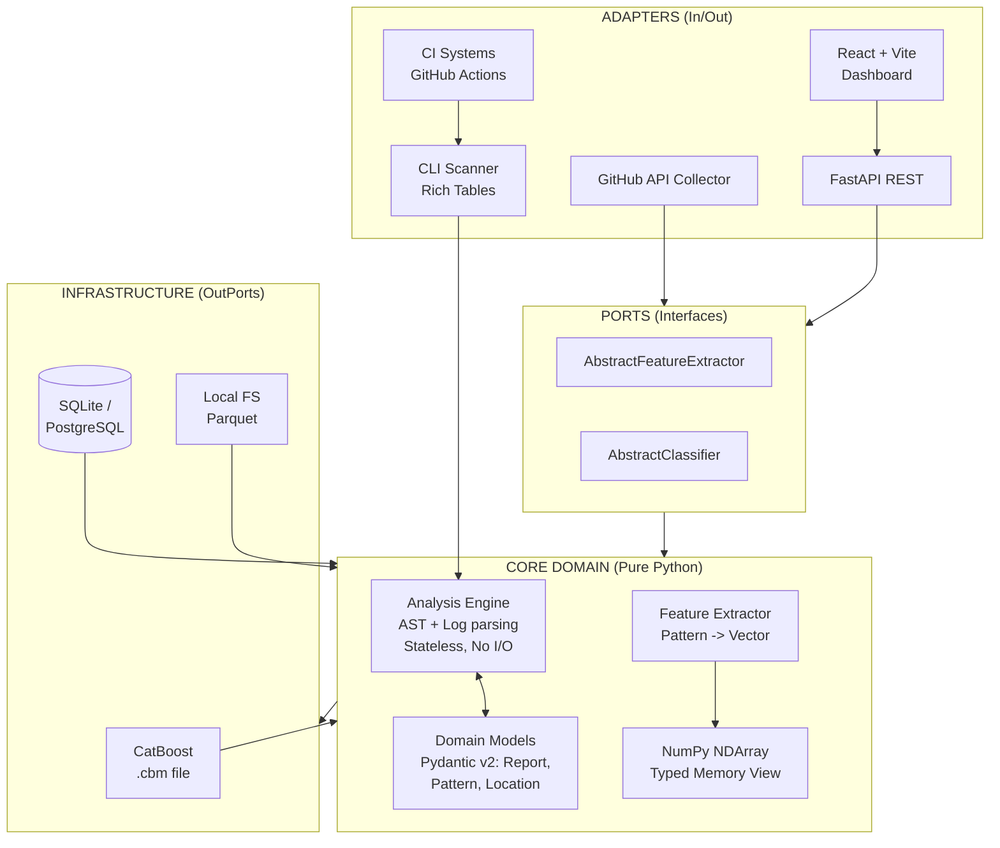

<div align="center">

# 🔬 FlakyDetector

[](https://www.python.org/)
[](https://fastapi.tiangolo.com/)
[](https://catboost.ai/)
[](https://www.docker.com/)
[](https://github.com/features/actions)
[](LICENSE)

**Обнаружение недетерминированных (flaky) тестов на основе AST-анализа и Machine Learning**

Scientific-grade · Explainable ML · AST Pattern Matching · 37D Feature Space · Test Smells

</div>

---

## 🧠 О проекте

**FlakyDetector** — исследовательский инструмент для обнаружения нестабильных тестов в Python-проектах. Вместо того чтобы полагаться на исторические данные прогонов CI, анализатор разбирает Абстрактное Синтаксическое Дерево (AST) исходного кода, извлекает научные признаки (features) и классифицирует их с помощью ML-модели CatBoost.

В отличие от обычных линтеров, FlakyDetector ищет архитектурные антипаттерны: race conditions, утечки ресурсов, зависимость от глобального состояния и высокую цикломатическую сложность (**Test Smells**).

---

## ✨ Ключевые возможности

| Возможность | Описание |
|-------------|----------|
| **🧬 AST Pattern Matching** | Детекция 11+ антипаттернов (`time.sleep`, `datetime.now()`, мутация глобальных переменных, немокированные сетевые вызовы). |
| **🧠 ML Classification** | Объяснимая модель CatBoost, обученная на 37-мерном векторе признаков. |
| **📊 Test Smells Analysis** | Выявление тестов с высокой цикломатической сложностью (>10), которые склонны к flakiness. |
| **🖥️ Interactive Dashboard** | React + Recharts фронтенд с визуализацией распределения severity и подсветкой синтаксиса. |
| **📂 CLI Scanner** | Мощное сканирование целых директорий с красивым табличным выводом в терминале (rich). |
| **⚙️ CI/CD Integration** | Готовый GitHub Actions workflow, который блокирует Pull Requests при обнаружении критических паттернов. |
| **🐳 Production Infrastructure** | Docker, `uv` для молниеносной сборки, pre-commit хуки (ruff, pyright). |

---

## 🏗️ Архитектура

### Clean Architecture (Hexagonal)



---

## 🚀 Быстрый старт

**Требования:** Python 3.12+, Node.js 18+ (для UI), Docker (опционально).

### Вариант 1: Локальная установка (через uv)

```bash
# 1. Клонируем репозиторий
git clone https://github.com/Artem7898/flakydetector
cd flakydetector

# 2. Устанавливаем uv (современный пакетный менеджер) и зависимости
curl -LsSf https://astral.sh/uv/install.sh | sh
uv venv --python 3.12 && source .venv/bin/activate
uv pip install -e ".[dev]"

# 3. Генерируем синтетический датасет и обучаем ML-модель
python scripts/train_model.py

# 4. Запускаем API-сервер
uvicorn flakydetector.dashboard.main:app --reload --port 8001
```

### Вариант 2: Docker (рекомендуется для изоляции)

```bash
# Собирает образ и запускает бэкенд на порту 8001
docker-compose up --build
```

### Запуск фронтенда (в новом терминале)

```bash
cd dashboard_frontend
npm install
npm run dev
```

🔗 Открой http://localhost:3000 — интерактивный дашборд готов.

---

## 📂 Сканирование папок и CI/CD

### Сканирование через CLI

Анализатор не ограничен веб-интерфейсом. Вы можете натравить его на любую папку с тестами:

```bash
uv run python scripts/scan_folder.py ./my_project/tests/
```

**Пример вывода:**

```
🔍 Scanning: ./my_project/tests/ ...

                               Flaky Patterns Detected
┏━━━━━━━━━━━━━━━━━━━━┳━━━━━━━┳━━━━━━━━━━━━━━━━━━━━━┳━━━━━━━━━━━━┳━━━━━━━━━━━┓
┃ File               ┃ Line  ┃ Pattern             ┃ Severity   ┃ Confidence┃
┡━━━━━━━━━━━━━━━━━━━━╇━━━━━━━╇━━━━━━━━━━━━━━━━━━━━━╇━━━━━━━━━━━━╇━━━━━━━━━━━┩
│ test_api.py        │     3 │ time_sleep          │   MEDIUM   │       90% │
└────────────────────┴───────┴─────────────────────┴────────────┴───────────┘
```

### Интеграция с GitHub Actions

Инструмент автоматически блокирует Pull Requests, если в код добавлены критические антипаттерны. Workflow уже добавлен в `.github/workflows/flaky_detection.yml`:

```yaml
- name: Run FlakyDetector
  run: uv run python scripts/scan_folder.py ./tests --fail-on-critical
```

Если найден паттерн с `severity: CRITICAL`, шаг завершится с кодом 1, и мерж будет запрещён.

---

## 🔬 Научная методология

Система конвертирует исходный код в математическое представление:

| Группа признаков | Кол-во | Описание |
|------------------|--------|----------|
| **AST Features** | 16 | Счётчики специфических антипаттернов (например, `ast_time_sleep: 1.0`). |
| **Category Features** | 9 | Агрегированные баллы корневых причин (Timing, State, Network). |
| **Test Smells** | 1 | Cyclomatic Complexity — цикломатическая сложность тестовой функции. |
| **Derived Features** | 3 | Математические отношения: `ast_to_log_ratio`, `pattern_diversity`. |
| **Confidence Scores** | 8 | Максимальные и средние уверенности детектора. |

**Итоговый вектор:** 37 признаков передаются в CatBoost, который обеспечивает как точность классификации, так и **Feature Importance** для научной интерпретируемости результатов.

---

## 🛠 Разработка

Проект следует строгим стандартам качества:

| Инструмент | Назначение |
|------------|------------|
| **ruff** | Форматирование и линтинг (заменяет black, isort, flake8). |
| **pyright** | Строгая типизация в strict mode (Pydantic v2, Type Hints). |
| **pytest + pytest-asyncio** | Юнит- и интеграционные тесты. |
| **pre-commit** | Автоматические проверки при каждом коммите. |

```bash
# Запуск линтинга
pre-commit run --all-files

# Запуск тестов
uv run pytest tests/unit/ -v
```

---

## 📜 Цитирование

Если вы используете FlakyDetector в научных исследованиях, пожалуйста, цитируйте:

```bibtex
@software{flakydetector2026,
  author = {Research Team},
  title = {FlakyDetector: Scientific-grade AST & ML Flaky Test Detection},
  year = {2026},
  url = {https://github.com/Artem7898/flakydetector}
}
```

---

## 👨‍💻 Автор

**Артем Алимпиев** — Python Developer

- 🐙 GitHub: [Artem7898](https://github.com/Artem7898)
- 💼 LinkedIn: [artem-alimpiev](https://www.linkedin.com/in/artem-alimpiev/)
- 📧 Email: [alimpievne@gmail.com](mailto:alimpievne@gmail.com)

---

## 📄 Лицензия

Распространяется под лицензией MIT. Подробности в файле [LICENSE](LICENSE).

---

<div align="center">

*Сделано для исследователей и инженеров. AST + ML. Точно. Воспроизводимо.*

</div>
