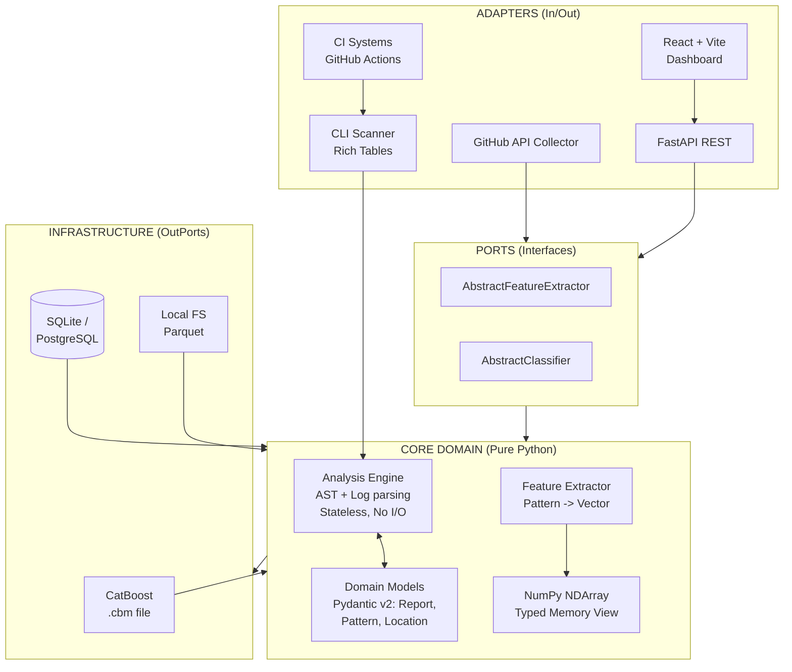

<div align="center">

# 🔬 FlakyDetector

[](https://www.python.org/)
[](https://fastapi.tiangolo.com/)
[](https://catboost.ai/)
[](https://www.docker.com/)
[](https://github.com/features/actions)
[](LICENSE)

**Scientific-grade Flaky Test Detection using AST Analysis & Machine Learning**

Explainable ML · AST Pattern Matching · 37D Feature Space · Test Smells

</div>

---

## 🧠 About

**FlakyDetector** is a research-oriented tool designed to identify non-deterministic (flaky) tests in Python codebases. Instead of relying on historical CI execution data, the analyzer parses the Abstract Syntax Tree (AST) of the source code, extracts scientific features, and classifies them using a CatBoost ML model.

Unlike ordinary linters, FlakyDetector hunts for architectural anti-patterns: race conditions, resource leaks, global state dependencies, and high cyclomatic complexity (**Test Smells**).

---

## ✨ Key Features

| Feature | Description |
|---------|-------------|
| **🧬 AST Pattern Matching** | Detection of 11+ anti-patterns (`time.sleep`, `datetime.now()`, global variable mutations, unmocked network calls). |
| **🧠 ML Classification** | Explainable CatBoost model trained on a 37-dimensional feature vector. |
| **📊 Test Smells Analysis** | Identifies tests with high cyclomatic complexity (>10) that are prone to flakiness. |
| **🖥️ Interactive Dashboard** | React + Recharts frontend with severity distribution visualization and syntax highlighting. |
| **📂 CLI Scanner** | Powerful directory scanning with beautiful tabular terminal output (rich). |
| **⚙️ CI/CD Integration** | Ready-to-use GitHub Actions workflow that blocks Pull Requests when critical patterns are detected. |
| **🐳 Production Infrastructure** | Docker, `uv` for lightning-fast builds, pre-commit hooks (ruff, pyright). |

---

## 🏗️ Architecture

### Clean Architecture (Hexagonal)



---

## 🚀 Quick Start

**Prerequisites:** Python 3.12+, Node.js 18+ (for UI), Docker (optional).

### Option 1: Local Setup (via uv)

```bash
# 1. Clone the repository
git clone https://github.com/Artem7898/flakydetector
cd flakydetector

# 2. Install uv (modern package manager) and dependencies
curl -LsSf https://astral.sh/uv/install.sh | sh
uv venv --python 3.12 && source .venv/bin/activate
uv pip install -e ".[dev]"

# 3. Generate synthetic dataset and train the ML model
python scripts/train_model.py

# 4. Start the API server
uvicorn flakydetector.dashboard.main:app --reload --port 8001
```

### Option 2: Docker (recommended for isolation)

```bash
# Builds the image and starts the backend on port 8001
docker-compose up --build
```

### Start Frontend (in a new terminal)

```bash
cd dashboard_frontend
npm install
npm run dev
```

🔗 Open http://localhost:3000 — the interactive dashboard is ready.

---

## 📂 Folder Scanning & CI/CD

### CLI Scanning

The analyzer is not limited to the web interface. You can point it at any test directory:

```bash
uv run python scripts/scan_folder.py ./my_project/tests/
```

**Sample output:**

```
🔍 Scanning: ./my_project/tests/ ...

                               Flaky Patterns Detected
┏━━━━━━━━━━━━━━━━━━━━┳━━━━━━━┳━━━━━━━━━━━━━━━━━━━━━┳━━━━━━━━━━━━┳━━━━━━━━━━━┓
┃ File               ┃ Line  ┃ Pattern             ┃ Severity   ┃ Confidence┃
┡━━━━━━━━━━━━━━━━━━━━╇━━━━━━━╇━━━━━━━━━━━━━━━━━━━━━╇━━━━━━━━━━━━╇━━━━━━━━━━━┩
│ test_api.py        │     3 │ time_sleep          │   MEDIUM   │       90% │
└────────────────────┴───────┴─────────────────────┴────────────┴───────────┘
```

### GitHub Actions Integration

The tool automatically blocks Pull Requests when critical anti-patterns are introduced. The workflow is already included in `.github/workflows/flaky_detection.yml`:

```yaml
- name: Run FlakyDetector
  run: uv run python scripts/scan_folder.py ./tests --fail-on-critical
```

If a pattern with `severity: CRITICAL` is found, the step exits with code 1 and the merge is blocked.

---

## 🔬 Scientific Methodology

The system converts source code into a mathematical representation:

| Feature Group | Count | Description |
|---------------|-------|-------------|
| **AST Features** | 16 | Counters for specific anti-patterns (e.g., `ast_time_sleep: 1.0`). |
| **Category Features** | 9 | Aggregate scores for root causes (Timing, State, Network). |
| **Test Smells** | 1 | Cyclomatic Complexity of the test function. |
| **Derived Features** | 3 | Mathematical ratios: `ast_to_log_ratio`, `pattern_diversity`. |
| **Confidence Scores** | 8 | Maximum and average detector certainties. |

**Resulting vector:** 37 features are fed into CatBoost, which provides both classification accuracy and **Feature Importance** for scientific interpretability of results.

---

## 🛠 Development

The project adheres to strict quality standards:

| Tool | Purpose |
|------|---------|
| **ruff** | Formatting and linting (replaces black, isort, flake8). |
| **pyright** | Strict typing in strict mode (Pydantic v2, Type Hints). |
| **pytest + pytest-asyncio** | Unit and integration tests. |
| **pre-commit** | Automated checks on every commit. |

```bash
# Run linting
pre-commit run --all-files

# Run tests
uv run pytest tests/unit/ -v
```

---

## 📚 Citation

If you use FlakyDetector in your research, please cite:

```bibtex
@software{flakydetector2026,
  author = {Research Team},
  title = {FlakyDetector: Scientific-grade AST & ML Flaky Test Detection},
  year = {2026},
  url = {https://github.com/Artem7898/flakydetector}
}
```

---

## 👨‍💻 Author

**Artem Alimpiev** — Python Developer

- 🐙 GitHub: [Artem7898](https://github.com/Artem7898)
- 💼 LinkedIn: [artem-alimpiev](https://www.linkedin.com/in/artem-alimpiev/)
- 📧 Email: [alimpievne@gmail.com](mailto:alimpievne@gmail.com)
- https://orcid.org/0009-0007-6740-7242
- https://zenodo.org/records/20042797


---

## 📄 License

Distributed under the MIT License. See [LICENSE](LICENSE) for details.

---

<div align="center">

*Built for researchers and engineers. AST + ML. Precise. Reproducible.*

</div>
