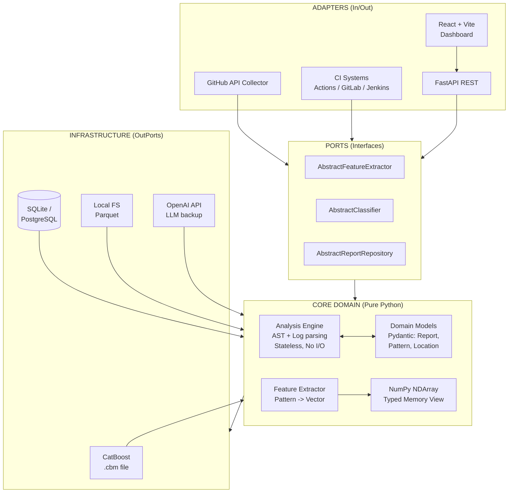
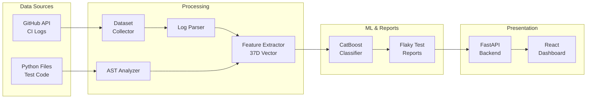

<div align="center">

# 🔬 FlakyDetector

[](https://www.python.org/)
[](https://fastapi.tiangolo.com/)
[](https://catboost.ai/)
[](LICENSE)

**Scientific-grade Flaky Test Detection using AST Analysis & Machine Learning**

Explainable ML · AST Pattern Matching · 37D Feature Space · Reproducible Science

</div>

---

## 📖 Overview

**FlakyDetector** is a research-oriented tool designed to identify non-deterministic (flaky) tests in Python codebases. It bridges the gap between static code analysis and ML-based classification to provide explainable, actionable results.

Instead of relying solely on test execution history, FlakyDetector parses the Abstract Syntax Tree (AST) of test files, extracts scientific feature vectors, and classifies them using a trained CatBoost model.

---

## ✨ Key Features

| Feature | Description |
|---------|-------------|
| **🔍 AST Pattern Matching** | Zero false-positive dependency on execution. Detects `time.sleep`, `datetime.now()`, global state mutations, unmocked network calls, and floating-point comparisons. |
| **🤖 ML Classification** | Explainable CatBoost model trained on engineered features (37-dimensional vector space). |
| **📊 Interactive Dashboard** | React + Recharts frontend for visualizing severity distributions and feature importances. |
| **🔬 Reproducible Science** | Built with Pydantic v2, strict typing, and synthetic data generators for 100% reproducible ML experiments. |

---

## 🏗️ Architecture

### Clean Architecture



### Data Flow



---

## 🚀 Quick Start

**Prerequisites:** Python 3.12+, Node.js 18+

### 1. Clone & Setup Backend

```bash
git clone https://github.com/yourorg/flakydetector.git
cd flakydetector
python -m venv .venv && source .venv/bin/activate
pip install -e ".[dev]"
```

### 2. Train ML Model

Generates synthetic dataset & saves `.cbm`:

```bash
python scripts/train_model.py
```

### 3. Start API Server

```bash
uvicorn flakydetector.dashboard.main:app --reload --port 8001
```

### 4. Start Frontend (in a new terminal)

```bash
cd dashboard_frontend
npm install
npm run dev
```

🔗 Open http://localhost:3000

---

## 🔬 Scientific Methodology

The system converts source code into a mathematical representation:

| Feature Category | Dimensions | Description |
|------------------|------------|-------------|
| **AST Features** | 16 | Counts of specific anti-patterns (e.g., `ast_time_sleep: 1.0`) |
| **Category Features** | 9 | Aggregate scores for root causes (Timing, State, Network) |
| **Derived Features** | 3 | Ratios like `ast_to_log_ratio` and `pattern_diversity` |
| **Confidence Scores** | 9 | Maximum and average detection certainties |

**Resulting vector:** 37 dimensions → CatBoost → flaky probability + Feature Importance for scientific explainability.

---

## 📚 Citation

If you use FlakyDetector in your research, please cite:

```bibtex
@software{flakydetector2026,
  author = {Research Team},
  title = {FlakyDetector: Scientific-grade AST & ML Flaky Test Detection},
  year = {2026},
  url = {https://github.com/yourorg/flakydetector}
}
```

---

## 👨‍💻 Author

**Artem Alimpiev** — Senior Python Developer

- 🐙 GitHub: [@your-github](https://github.com/your-github)
- 💼 LinkedIn: [linkedin.com/in/your-profile](https://linkedin.com/in/your-profile)
- 📧 Email: your.email@example.com

---

## 📄 License

This project is licensed under the MIT License. See [LICENSE](LICENSE) for details.

---

<div align="center">

*Built for reproducible science. AST + ML. Explainable. Deterministic.*

</div>
